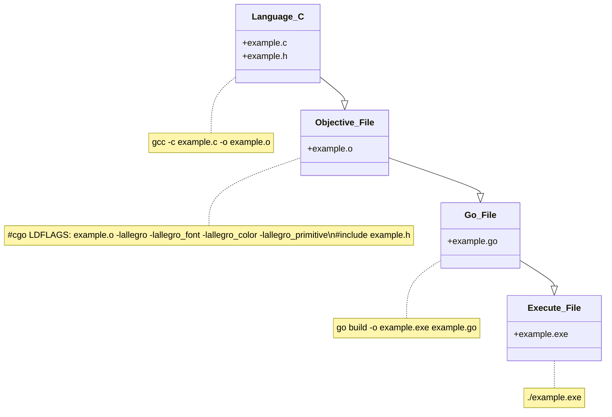

# SK2_R_P_S
Projekt na przedmiot Sieci Komputerowe 2.  
# Rock Paper Scissors.
---
# Temat: Implementacja gry papier, kamień, nożyce w otoczeniu sieciowym, z dodatkową implementacją umiejętności specjalnych.  
---
## 1. Wybór środowiska, narzędzi i języków oprogramowania.
---

1. A. Klient:  
Środowiskiem uruchomieniowym [klienta](#client) jest system Windows, ze względu na popularność jego w systemach desktopowych, mnogość bibliotek graficznych, łatwość uruchomienia aplikacji. Narzędziami niezbędnymi zbudowania klienta są [msys2](https://www.msys2.org)- potężny terminal, z mocno rozbudowanym [mingw](https://pl.wikipedia.org/wiki/MinGW), z własnymi kompilatorami i interpreterami języków takich jak python, [golang](https://pl.wikipedia.org/wiki/Go_(język_programowania)), z możliwością dołączania ścieżek i aliasów, za pomocą pliku .bashrc oraz możliwością odpaleniem z tego terminalu narzędzi od jetbrains takich jak: clion i goland. Językiem programowania jest język [go](#golang), który umożliwia korzystanie z łatwej metody łączenia go z językiem C i nieco trudniejszymi metodami dla języków takich jak C++, czy python. Jest to język współbieżny z łatwą implementacją współbieżności, robi zarazem za cmake, lub za skrypty basha. 
1. B. Serwer:  
Środowiskiem uruchomieniowym [serwera](#server) jest system linux, ze względu na lepsze biblioteki w języku C. Serwery są także robione w golangu.
---
## 2. Biblioteka graficzna dla klienta.
---
2. A. Bilioteka graficzna dla [klienta](#client) to [allegro5](https://liballeg.org), jest implementowana dla plików w języku C. Cały interfejs graficzny będzie w części dotyczącej języka C. Będą istnieć zmienne lub struktury globalne, w celu komunikacji z golangiem. Funkcje będą wykonywane z poziomu golanga, ale komunikacja pomiędzy bibliotekami różnych języków będzie odbywać się poprzez struktury globalne języka C, których klony będą istnieć w języku go.  
---
### Kompilacja biblioteki graficznej [allegro5](https://liballeg.org) z języka C do pliku typu exe, przy użyciu kompilatorów gcc oraz go:
---

---
## 3. Krótki opis aplikacji:
###
Gra to sieciowa wersja gry papier, kamień, nożyce. Gra składa się z walk i rund.  
Walka to niedoprecyzowana ilość rund i kończy się, gdy pozostanie jedna osoba na placu boju.  
Runda polega na wybraniu kamienia [q], nożyczek[w] lub papieru[e] oraz klawisza [r] w tym samym czasie pomiędzy 3-cią, a 10-tą sekundą rundy.  
Wygrywanie rund polega na przewadze wg cyklu q>w>e>q. Wszystkie normalne przypadki wygranej są raczej zrozumiałe. Przypadek, kiedy wszystkie opcje są obstawione przez wszystkich zawodników ma dwa rozwiązania. Pierwsze, kiedy jest nierówna liczba zawodników, którzy wybrali jedną z trzech opcji, to wygrywają ci zawodnicy, których jest najmniej przy danej opcji. Druga, kiedy jest równa liczba zawodników przy każdej z opcji, to jest remis.  
Każdy zwycięzca rundy otrzymuje punkt zaklęć tego typu, jakim symbolem wygrał rundę, zwycięzca walki otrzymuje dodatkowo po jednym punkcie każdego typu. Jeżeli zostaną zdobyte 3 punkty. To w pierwszych trzech sekundach rundy można stworzyć zaklęcie. Po trzeciej sekundzie można je użyć naciskając klawisz [f]. Użycie [f] przed 3-cią sekundą powoduje reset buffora, wpisanie czwartej litery z [q,w,e] usuwa pierwszą literę z bufora zaklęć. 
Dotarcie do 10 s rundy automatycznie wywołuje opcje walki z ostatnią literą jaką nacisnął gracz, w tym z buffora zaklęć. Jeżeli gracz nie nacisnął żadnego przycisku w jakiejkolwiek rundzie, zostaje mu przypisany przycisk losowy, który towarzyszy jego postaci do czasu, jak nie naciśnie jakiegolwiek przycisku.
Przyciskanie klawiszy q|w|e + r ma na celu przyspieszenie rundy przez wszystkich zawodników.
Gracz w ciągu 7s rundy może wprowadzić dowolną ilość zaklęć, o ile pozwalają na to nałożone na niego efekty przeciwnika.
Zaklęcia, które nie wywołały efektu na przeciwniku, zwracają 2 losowe punkty zużyte na zaklęcie.
---
### Spis zaklęć:
---
|zaklęcia| q | w | e |
|:---:|:---:|:---:|:---:|
| | | |  |

|buf1|buf2|buf3|nazwa|opis|
|:---:|:---:|:---:|:---:|:---:|
|||| Cold Snap | Zatrzymuje przeciwnika z klawiszem, jaki wcisnął w ostatniej rundzie|
|||| Ghost Walk | Zaklęcie uniemożliwia bycie celem wrogiego zaklęcia do końca rundy, poza Deafening Blast|
|||| Ice Wall | Zaklęcie losowo opóźnia czas wywoływania zaklęć wszystkich przeciwników pomiędzy 0 a 1 s, oraz skraca ich czas rundy o jedną sekundę, tym samym uniemożliwiając efekty niektórych zaklęć, może samoistnie się nakładać z innymi tego typu zaklęciami. Trwa 3 rundy.|
|||| Tornado | Zaklęcie wyklucza z pisania zaklęć z conajmniej połowy, a maksymalnie wszystkich przeciwników na 3 sekundy rundy|
|||| Deafening Blast | Zaklęcie zamraża pozostałych graczy do końca rundy i zostawia ich z ostatnimi włączonymi klawiszami, klawisze przeciwników są widoczne dla rzucającego zaklęcie, poza zawodnikami używającymi ghost walk w tej rundzie|
|||| Forged Spirit | Gracz dodaje po jednym punkcie obstawień do pozostałych pól, co zwiększa jego szansę na wygraną poprzez remis, jeżeli dane pole jest obstawione tylko przez forget spiryty, to wygrywają użytkownicy tego zaklęcia|
|||| E.M.P. | Po jednej sekundzie uniemożliwia używania zaklęć u losowych przeciwników conajmniej połowy|
|||| Aclarity | Zaklęcie to umożliwia używanie zaklęć od 2s na najbliższe 3 rundy i podwaja liczbę punktów za zwycięstwo w rundzie|
|||| Chaos Meteor | Zaklęcie likwiduje losowo punkty u innych zawodników, ma 1/10 szans na likwidację każdego przeciwnika|
|||| Sun Strike | Zaklęcie to zabija przeciwnika, a wywołane dwa razy w jednej rundzie przez tą samą osobę, zabija wszystkich przeciwników i gracz wygrywa walkę z klawiszem [e]|

