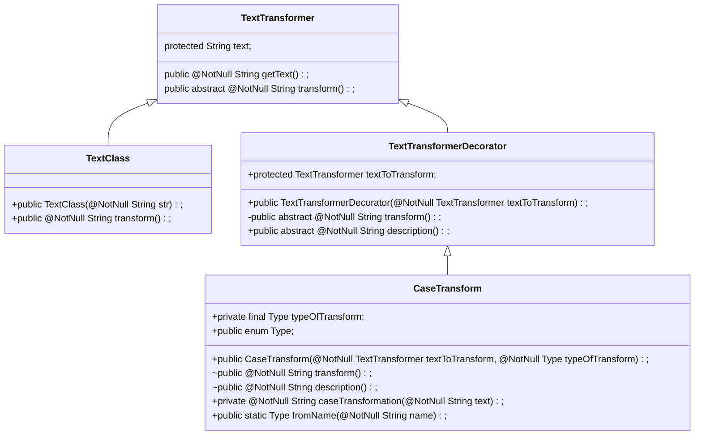

## Diagram Logiki

```mermaid
classDiagram
  class TextTransformer {
    protected String text;
    public @NotNull String getText();
    public abstract @NotNull String transform();
  }
  class TextClass {
    +public TextClass(@NotNull String str);
    +public @NotNull String transform();
  }
  class TextTransformerDecorator {
    +protected TextTransformer textToTransform;
    +public TextTransformerDecorator(@NotNull TextTransformer textToTransform);
    -public abstract @NotNull String transform();
    +public abstract @NotNull String description();
  }
  class CaseTransform {
    +private final Type typeOfTransform;
    +public CaseTransform(@NotNull TextTransformer textToTransform, @NotNull Type typeOfTransform);
    ~public @NotNull String transform();
    ~public @NotNull String description();
    +private @NotNull String caseTransformation(@NotNull String text);
    +public enum Type;
    +public static Type fromName(@NotNull String name);
  }
  TextTransformer <|-- TextTransformerDecorator
  TextTransformer <|-- TextClass
  TextTransformerDecorator <|-- CaseTransform
```