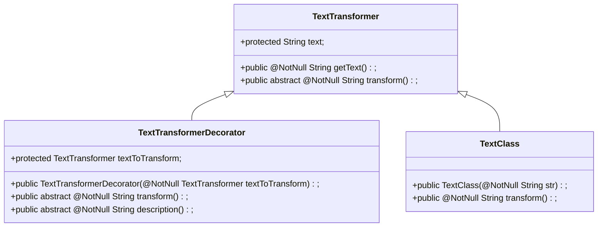

## Diagram Logiki

```mermaid
classDiagram
  class TextTransformer {
    +protected String text;
    +public @NotNull String getText();
    +public abstract @NotNull String transform();
  }
  class TextClass {
    +public TextClass(@NotNull String str);
    +public @NotNull String transform();
  }
  class TextTransformerDecorator{
    +protected TextTransformer textToTransform;
    +public TextTransformerDecorator(@NotNull TextTransformer textToTransform);
    +public abstract @NotNull String transform();
    +public abstract @NotNull String description();
  }
  TextTransformer <|-- TextTransformerDecorator
  TextTransformer <|-- TextClass
```